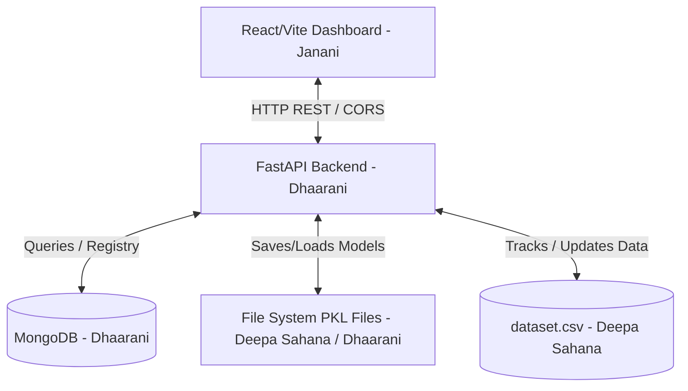

# EcoTrack: Academic Review Portfolio (Architecture, APIs & MLOps Strategies)

This comprehensive portfolio compiles the high-level architecture design, REST API specifications, and MLOps strategies implemented for the **EcoTrack** internship project review.

---

## Part 1: System Architecture & Contributor Design

EcoTrack is a carbon-aware MLOps governance middleware designed to govern, monitor, and regulate machine learning training and promotion life cycles. The project acts as a prototype for enterprise MLOps, balancing model performance with environmental compliance (carbon intensity, water cooling loss, and tax liabilities).

### 🏗️ High-Level System Architecture

EcoTrack utilizes a modern decoupled three-tier architecture:



#### 1. Presentation Tier (Frontend Dashboard)
*   **Technologies**: React, Vite, Recharts (time-series graphing), Vanilla CSS, Lucide Icons.
*   **Responsibility**: Real-time rendering of system states, inference deviation graphs, compliance ledger metrics, and model versions.

#### 2. Logic Tier (Backend Services)
*   **Technologies**: FastAPI, Uvicorn, Scikit-learn (DecisionTreeRegressor), Pandas, NumPy, Joblib.
*   **Responsibility**: Serving APIs for telemetry (`/status`), mock drift injection (`/inject`), carbon-aware retraining (`/retrain`), database rollbacks (`/rollback`), and system reset (`/reset`).

#### 3. Data Tier (Database & Storage)
*   **Technologies**: MongoDB, local File System.
*   **Responsibility**: Storing audit prediction logs in a `predictions` collection, version control documents in a `model_registry` collection, and raw features in `dataset.csv`.

---

### 👥 Team Contribution & Roles

The project responsibilities were distributed among three core team members:

#### 1. Deepa Sahana: Data Collection & Model Training
*   **Architectural Role**: Data Pipeline & ML Engine.
*   **Responsibilities**:
    *   Designed the base Air Quality Index (AQI) dataset structure following Central Pollution Control Board (CPCB) schemas.
    *   Curated standard features (`PM2.5`, `PM10`, `NO2`, `CO`, `SO2`) and target label (`AQI`).
    *   Constructed the baseline machine learning model using a `DecisionTreeRegressor` (max depth of 5 for optimal speed and generalization).
    *   Crafted statistical simulation patterns to mimic "2026 environmental shock/crisis data" to trigger feature drift.

#### 2. Dhaarani: API Development & Database Governance (`api.py`)
*   **Architectural Role**: Backend Architecture, Database Operations & MLOps Orchestration.
*   **Responsibilities**:
    *   Programmed the FastAPI backend endpoints, configuring CORS middleware for local frontend requests.
    *   Engineered the **Eco-Gate Governance logic**, computing carbon intensity (gCO2/kWh), water cooling overhead, and compliance tax penalties based on simulated grid peak/off-peak hours.
    *   Designed the **MongoDB Integration** connecting to local collections (`predictions` for auditing, `model_registry` for version control).
    *   Solved the **Model Rollback bug** by saving versioned pickled weights (`models/champion_vX.Y.pkl`) and adding dataset truncation logic, reverting the data state dynamically alongside the weights.

#### 3. Janani: Frontend UI/UX Design (`frontend`)
*   **Architectural Role**: UI/UX & Interactive Console.
*   **Responsibilities**:
    *   Built the single-page React client using Vite for fast hot-module reloading.
    *   Designed the **Premium Landing Page Portal** containing glowing visual backdrop orbs, floating animations, and high-fidelity feature summaries.
    *   Implemented the main control dashboard, incorporating interactive sliders for grid hour timelines, buttons to trigger drift injection, and tables to swap active versions.
    *   Programmed route navigation enabling presenters to exit operations back to the welcome portal during live reviews.

---

## Part 2: Core REST API Documentation

The backend server operates on **port 8000** and communicates with clients via JSON payloads.

### 📡 Endpoints Overview

| Method | Endpoint | Description | Auth |
| :--- | :--- | :--- | :--- |
| **GET** | `/status` | Fetches active telemetry, MAE/R², compliance tax ledger, and model version registry list. | None |
| **POST** | `/inject` | Skews the feature distributions by appending 100 rows of anomalous 2026 climate drift data. | None |
| **POST** | `/retrain` | Triggers a retraining cycle and evaluates Challenger vs. Champion via a Tournament Duel. | None |
| **POST** | `/rollback` | Swaps active model weights and truncates `dataset.csv` back to versioned limits. | None |
| **POST** | `/reset` | Flushes MongoDB registry collections and rewrites `dataset.csv` to baseline 60 rows. | None |

---

### 📖 Endpoint Details

#### 1. System Telemetry Engine
*   **Path**: `/status`
*   **Method**: `GET`
*   **Query Parameters**: 
    *   `hour` (int, default=12): The simulated time of day (0-23) used for carbon intensity computation.
*   **Successful Response (200 OK)**:
    ```json
    {
      "mae": 0.88,
      "r2": 0.98,
      "status_state": "HEALTHY",
      "status_message": "Statistical variances are behaving cleanly within historical thresholds.",
      "compliance": {
        "hour": 12,
        "is_dirty": false,
        "carbon_intensity": 65,
        "grid_description": "CLEAN (Renewable Solar Surplus Abundance)",
        "water_loss_liters": 12.1,
        "tax_usd": 0.0975,
        "tax_inr": 8.12
      },
      "active_version": "v1.0",
      "model_history": [
        {
          "version": "v1.0",
          "model_path": "models/champion_v1.0.pkl",
          "trained_at": "2026-06-11T20:30:19.413229",
          "r2": 0.98,
          "mae": 0.88,
          "description": "Baseline historical Champion model",
          "dataset_rows": 60
        }
      ],
      "chart_data": [
        { "index": 0, "actual": 42.5, "predicted": 43.1 }
      ],
      "dataset_rows": 60
    }
    ```

#### 2. Drift Simulator
*   **Path**: `/inject`
*   **Method**: `POST`
*   **Successful Response (200 OK)**:
    ```json
    {
      "status": "success",
      "message": "Successfully injected 100 rows of 2026 skewed crisis data into dataset.csv and MongoDB predictions log."
    }
    ```

#### 3. Retraining Tournament Engine
*   **Path**: `/retrain`
*   **Method**: `POST`
*   **Request Body**:
    ```json
    {
      "hour": 20,
      "override": true
    }
    ```
*   **Blocked Response (200 OK - Grid Dirty & Override False)**:
    ```json
    {
      "status": "blocked",
      "message": "Retraining BLOCKED by Eco-Gate: Grid carbon intensity is high and ambient factors are unfavorable."
    }
    ```
*   **Success Response (200 OK)**:
    ```json
    {
      "status": "success",
      "tournament_won": true,
      "champion": {
        "version": "v1.0",
        "r2": -191.5001,
        "mae": 389.01
      },
      "challenger": {
        "r2": 0.7448,
        "mae": 10.34
      }
    }
    ```

#### 4. Rollback Version Controller
*   **Path**: `/rollback`
*   **Method**: `POST`
*   **Request Body**:
    ```json
    {
      "version": "v1.0"
    }
    ```
*   **Successful Response (200 OK)**:
    ```json
    {
      "status": "success",
      "message": "Successfully rolled back active production weights and reverted data state to version v1.0."
    }
    ```

#### 5. System Reset Engine
*   **Path**: `/reset`
*   **Method**: `POST`
*   **Successful Response (200 OK)**:
    ```json
    {
      "status": "success",
      "message": "EcoTrack database, model registry, and dataset.csv fully reset to baseline state."
    }
    ```

---

## Part 3: Carbon-Aware MLOps Implementation Strategies

This section describes the MLOps strategies incorporated into EcoTrack to enable carbon-aware pipeline automation, continuous testing, version registry management, and state rollbacks.

### 1. Governance & Environmental Gating (The Eco-Gate)
Traditional MLOps pipelines run triggers blindly on CPU/GPU clusters as soon as drift is detected, regardless of grid energy health. EcoTrack implements the **Eco-Gate** as a governance middleware:
*   **Peak Grid Auditing**: Evaluates regional carbon intensity dynamically based on simulated time (Peak coal-dependent hours vs Off-peak solar-rich hours).
*   **Tax Compliance calculation**: Quantifies training costs in USD ($) and Indian Rupees (₹) based on simulated power consumption and regional tariff tax rates, providing a visual "Inaction Cost vs Action Cost" ledger before kicking off compute.

### 2. Drift Detection & Automated Simulation
Rather than operating in static sandboxes, EcoTrack features an **Inference Deviation Monitor**:
*   **Drift Injection**: Simulates feature and label shift by introducing a 100-record high-pollution industrial anomaly.
*   **Real-time Deviation Tracking**: The React UI uses time-series visualization comparing actual targets vs predicted values, demonstrating structural variance detection.

### 3. Cumulative History Tournament Duel
To prevent model degradation and ensure quality control, model promotion is governed by a automated tournament duel:
*   **Validation Slice Isolation**: Separates the latest 20 drifted records as a validation dataset.
*   **Challenger Pipeline**: Trains a candidate model on clean historical data merged with fresh operational parameters.
*   **Promotion criteria**: Compares Challenger metrics ($R^2$ and MAE) against the active Champion on the validation slice. Model promotion (weights swap and registry insertion) triggers automatically only if the Challenger beats the Champion.

### 4. Double-Swapping & Data Rollback Alignment
A primary issue in real-world rollbacks is data inconsistency (new model rollbacks run on dirty data streams). EcoTrack solves this through **Double-Alignment Rollback**:
*   **Model Registry Metadata**: Stored in a MongoDB registry collection (`model_registry`), mapping the unique ID, trained timestamp, model binary path, and the exact count of lines in `dataset.csv` at training time.
*   **Rollback Reversion**: Rollbacks loaded from the registry hot-swap active memory weights *and* truncate `dataset.csv` back to its versioned limit. This resets the telemetry dashboard visually, ensuring data state and model state remain perfectly in sync.
